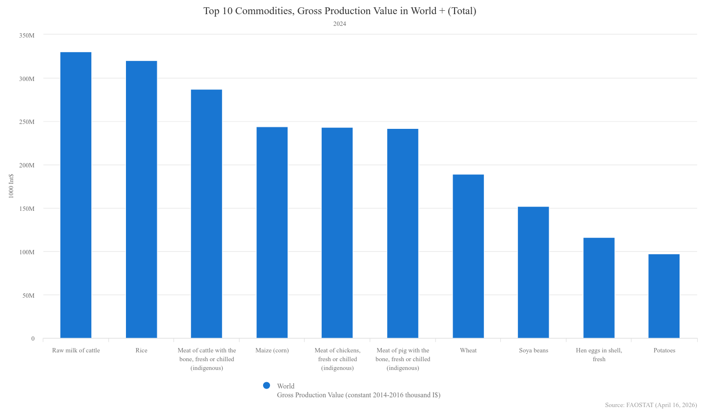
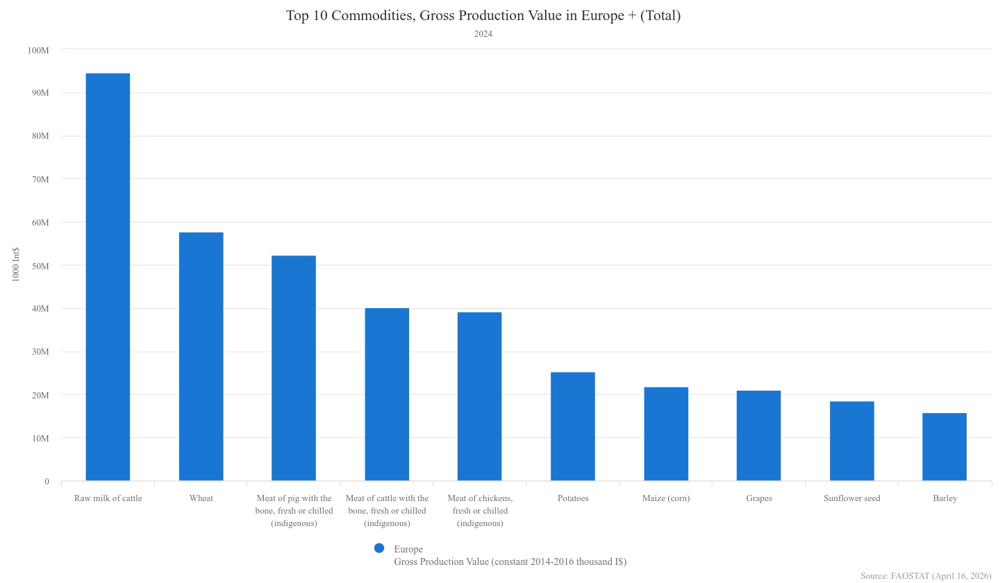

## Feature Selection

全球作物交易量

欧洲作物交易量

乌克兰的主要出口作物为小麦，葵花籽油，土豆，玉米

## Algorithm

有3种选择node权重的方式：
1. 将所有feature统一转化为美元，以美元作为统一价值衡量粮食贸易市场的食物、资金流向
2. 根据市场中不同作物的总产量价值，挑选前K个作物作为特征，分别对每个特征运行hits算法，最后进行特征融合：
> 多层网络架构 (Multiplex Networks) 与“后融合”这是网络科学（Network Science）中最优雅、最能保留原始信息的方法。既然把“苹果”和“小麦”强行加在一起总是有些别扭，那我们干脆在图的结构上就不加了！构建多层图： 不要建一张大图，而是建 $N$ 张平行的子图（$N$ 是食品种类数）。Layer 1: 纯小麦的贸易图（边权重就是小麦的真实物理吨数）。Layer 2: 纯大豆的贸易图（边权重是大豆的物理吨数）。Layer N: 纯肉类的贸易图...分别运行 HITS（保持独立性）：在每一层图上独立运行一次加权 HITS 算法。这样你会得到一个国家作为“小麦枢纽”的分数，以及作为“大豆枢纽”的分数。后融合 (Late Fusion)：拿到每个国家在不同维度下的 Hub 和 Authority 分数后，再使用客观赋权法（如我们在节点特征中提到的熵权法、PCA）将这些分数组合成该国的最终“综合 Hub 分数”。
3. 最后一种是对所有的作物做PCA，直接筛选出有效的特征分数

## 数据集分析

网络本身的节点（全球190+的国家）并不大，并且国家之间的贸易并不会特别密集，这导致adj matrix非常稀疏，会进一步节省算法运行时间

## 数据处理
异常值、缺失值处理，矩阵的稀疏性质造成的麻烦

## 改进方向

1. 时序Hits
2. Evaluation方法，如何评价算法生成的最后的ranking的好坏

> 对于evaluation目前有大概两种想法：
> 1. 使用权威的贸易数据排名来印证算法的有效性，比如如果排名高的国家同样在算法最后的结果中排名高，那么能够一定程度上证明算法捕捉到了这种贸易数据下的关联性
> 2. 

3. cascading failure simulation补充实验，可以被用于证明当某个节点失效的时候，失效本身对周遭乃至整个网络造成的影响，这与本项目的建项动机一致。